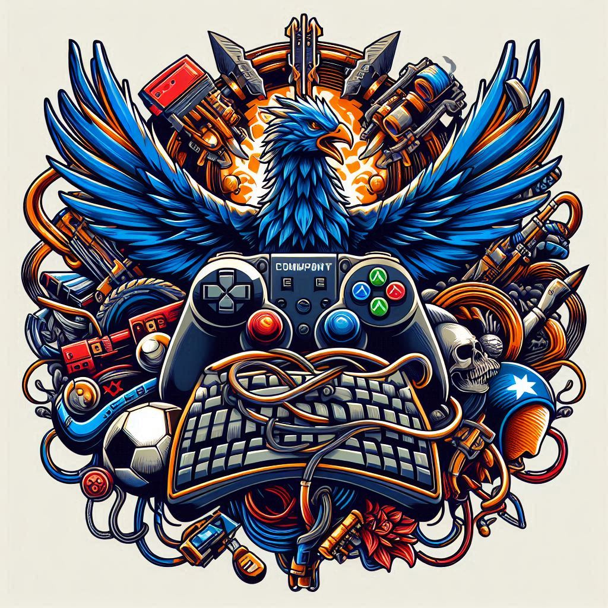

# [Game Title]

*[COMPANY NAME](https://example.com/)*

_COMPANY SLOGAN_

Copyright 202X

_<Suggestion: center this first page -- Pandoc hates my tries for centering>_

\newpage

## Project Description

*[Brief description of the game concept]*

## Version History

|    Version #    | Implemented By | Revision Date  |  Approved By   | Approval Date  |    Reason      |
|-----------------|----------------|----------------|----------------|----------------|----------------|
|      0.0.1      | [Name]         | [Date]         |                |                | Initial draft  |

\newpage  
## Table of Contents

1. [Game Overview](#game-overview)
   (1.1) [Concept](#concept)
   (1.2) [Genre](#genre)
   (1.3) [Target Audience](#target-audience)
2. [Player Experience](#player-experience)
   (2.1) [Core Player Experience](#core-player-experience)
   (2.2) [Player Motivations](#player-motivations)
   (2.3) [Types of Experiences](#types-of-experiences)
3. [Gameplay Design Overview](#gameplay-design-overview)
   (3.1) [Mechanics](#mechanics)
   (3.2) [Gameplay](#gameplay)
   (3.3) [Experience](#experience)
4. [Mechanics and Systems](#mechanics-and-systems)
   (4.1) [Core Mechanics](#core-mechanics)
   (4.2) [Game Systems](#game-systems)
   (4.3) [Items and Powerups](#items-and-powerups)
5. [Gameplay](#gameplay)
   (5.1) [Goal](#goal)
   (5.2) [User Skills](#user-skills)
   (5.3) [Progression and Challenge](#progression-and-challenge)
   (5.4) [Losing](#losing)
6. [User Experiences](#user-experiences)
   (6.1) [Story](#story)
      (6.1.1) [Theme](#theme)
      (6.1.2) [Story Progression](#story-progression)
   (6.2) [Characters](#characters)
   (6.3) [Art Style](#art-style)
   (6.4) [Music and Sounds](#music-and-sounds)
7. [Technical Description](#technical-description)
8. [Development Approach](#development-approach)
   (8.1) [Minimum Viable Product](#minimum-viable-product)
   (8.2) [Minimum Marketable Product](#minimum-marketable-product)
   (8.3) [Future Sprints](#future-sprints)
9. [Marketing and Funding](#marketing-and-funding)
   (9.1) [Demographics](#demographics)
   (9.2) [Platforms and Monetization](#platforms-and-monetization)
   (9.3) [Localization](#localization)
10. [Level Requirements](#level-requirements)
    (10.1) [Level Diagram](#level-diagram)
    (10.2) [Asset Revelation Schedule](#asset-revelation-schedule)
    (10.3) [Level Design Seeds](#level-design-seeds)
11. [Other Ideas](#other-ideas)
12. [Common Pitfalls to Avoid](#common-pitfalls-to-avoid)

\newpage
## 1. Game Overview

### 1.1. Concept
*[Briefly describe the core concept of the game]*

### 1.2. Genre
*[Define the game's genre or mix of genres]*

### 1.3. Target Audience
*[Describe the primary target audience for the game]*

## 2. Player Experience

### 2.1. Core Player Experience
*[Describe the primary experience you want players to have]*

### 2.2. Player Motivations
*[Outline the key player motivations your game targets (e.g., challenge, action, learning, exploration)]*

### 2.3. Types of Experiences
*[List the specific types of experiences your game aims to provide (e.g., frustration/fiero, adrenaline rush, discovery)]*

## 3. Gameplay Design Overview

### 3.1. Mechanics
*[Summary/Abstract: Describe the basic game elements, rules, and player inputs/outputs]*

### 3.2. Gameplay
*[Summary/Abstract: Explain how the game unfolds over time, including activity patterns and player behavior]*

### 3.3. Experience
*[Summary/Abstract: Detail how the mechanics and gameplay combine to create the desired player experience]*

## 4. Mechanics and Systems

### 4.1. Core Mechanics
*[Detailed description of core gameplay mechanics]*

### 4.2. Game Systems
*[Describe how multiple mechanics combine to form game systems]*

### 4.3. Items and Powerups
*[List and describe items and power-ups available in the game]*

## 5. Gameplay

### 5.1. Goal
*[Describe the main objectives for the player]*

### 5.2. User Skills
*[List the skills players need to master to play the game; consider items and powerups for example]*

### 5.3. Progression and Challenge
*[Explain how difficulty increases and how players can overcome challenges]*

### 5.4. Losing
*[Describe losing conditions and what happens when players lose]*

## 6. User Experiences

### 6.1. Story

#### 6.1.1. Theme
*[Describe the overall theme and tone of the game]*

#### 6.1.2. Story Progression
*[Explain how the story unfolds throughout the game]*

### 6.2. Characters
*[Describe the main characters, their personalities, and roles in the game]*

### 6.3. Art Style
*[Describe the visual style of the game, including any concept art]*

### 6.4. Music and Sounds
*[Describe the audio style, music, and sound effects]*

## 7. Technical Description
*[Outline technical aspects, platforms, and tools used for development]*

## 8. Development Approach

### 8.1. Minimum Viable Product
*[Define the core features and content for the initial playable version]*

### 8.2. Minimum Marketable Product
*[Outline the features and content required for the first public release]*

* Otherwise see definitions [HERE](https://web.archive.org/web/20191206184139/https://www.disciplinedagiledelivery.com/defining-mvp/) or [HERE](https://aaf.dau.edu/aaf/software/mvp-mvcr/).

### 8.3. Future Sprints
*[List planned features and improvements for post-release development]*

## 9. Marketing and Funding

### 9.1. Demographics
*[Define the target audience]*

### 9.2. Platforms and Monetization
*[List target platforms and monetization strategies]*

### 9.3. Localization
*[Outline plans for language support and localization]*

## 10. Level Requirements

### 10.1. Level Diagram
*[Provide a diagram or description of the game's level structure]*

### 10.2. Asset Revelation Schedule
*[Outline when and how assets will be revealed to the player]*

### 10.3. Level Design Seeds
*[List potential level ideas or concepts for the game]*

## 11. Other Ideas
*[Share any additional ideas that does not fit elsewhere]*

## 12. Common Pitfalls to Avoid
*[Highlight common mistakes in game design and development to avoid]*

- Insufficient details
- Patronizing material
- Ambiguous or contradictory material
- Overly lengthy or complex design
- Getting too personal with the design
- Wandering vision
- Avoiding accessibility issues [(See Website Here)](https://gameaccessibilityguidelines.com/full-list/)
